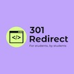

[301 Redirect](https://github.com/301-Redirect)
=======================================================================

  
[**Explore the screenshots »**](#about-us)  
  
[Report a Bug](https://github.com/301-Redirect/.github/issues/new)
[Request a Feature](https://github.com/301-Redirect/.github/issues/new)
[Ask a Question](https://github.com/GITHUB_USERNAME/REPO_SLUG/issues/new?assignees=&labels=question&template=04_SUPPORT_QUESTION.md&title=support%3A+)

  

[![An organisation made with hearth by Sasutski\]\](https://github.com/Sasutski)

Table of Contents - \[About Us\](#about-us) - \[What do we do?\](#what-do-we-do) - \[Usage\](#usage) - \[Roadmap\](#roadmap) - \[Support\](#support) - \[Project assistance\](#project-assistance) - \[Authors & contributors\](#authors--contributors) - \[Security\](#security) - \[License\](#license) - \[Acknowledgements\](#acknowledgements)

---

## About us

> Our organisation helps empower future generations with knowledge of IOT and promotes their ideas through our organisation.
> We intend to nuture and foster the right side of the human brain in children, which control creativity and imagination.

> **[?]**
> Please provide your screenshots here.

|                               Home Page                               |                               Login Page                               |
| :-------------------------------------------------------------------: | :--------------------------------------------------------------------: |
|  |  |

## What do we do

> We teach children how to code for web development to give them the tools to foster their creativity.

## Usage

> **[?]**
> How does one go about using it?
> Provide various use cases and code examples here.

## Roadmap

See the [open issues](https://github.com/GITHUB_USERNAME/REPO_SLUG/issues) for a list of proposed features (and known issues).

- [Top Feature Requests](https://github.com/GITHUB_USERNAME/REPO_SLUG/issues?q=label%3Aenhancement+is%3Aopen+sort%3Areactions-%2B1-desc) (Add your votes using the 👍 reaction)
- [Top Bugs](https://github.com/GITHUB_USERNAME/REPO_SLUG/issues?q=is%3Aissue+is%3Aopen+label%3Abug+sort%3Areactions-%2B1-desc) (Add your votes using the 👍 reaction)
- [Newest Bugs](https://github.com/GITHUB_USERNAME/REPO_SLUG/issues?q=is%3Aopen+is%3Aissue+label%3Abug)

## Support

> **[?]**
> Provide additional ways to contact the project maintainer/maintainers.

Reach out to the maintainer at one of the following places:

- [GitHub issues](https://github.com/GITHUB_USERNAME/REPO_SLUG/issues/new?assignees=&labels=question&template=04_SUPPORT_QUESTION.md&title=support%3A+)
- Contact options listed on [this GitHub profile](https://github.com/GITHUB_USERNAME)

## Project assistance

If you want to say **thank you** or/and support active development of 301 Redirect:

- [Follow](https://github.com/301-redirect) our organisation.
- Share about 301 Redirect on social media.

Together, we can make 301 Redirect **better**!

## Authors & contributors

The original setup of this organisation is by [Sasutski](https://github.com/sasutski).

For a full list of all authors and contributors, see [the contributors page](https://github.com/301-redirect/.github/contributors).

## Security

PROJECT_NAME follows good practices of security, but 100% security cannot be assured.
PROJECT_NAME is provided **"as is"** without any **warranty**. Use at your own risk.

_For more information and to report security issues, please refer to our [security documentation](docs/SECURITY.md)._

## License

This project is licensed under the **MIT license**.

See [LICENSE](LICENSE) for more information.

## Acknowledgements

> **[?]**
> If your work was funded by any organization or institution, acknowledge their support here.
> In addition, if your work relies on other software libraries, or was inspired by looking at other work, it is appropriate to acknowledge this intellectual debt too.

